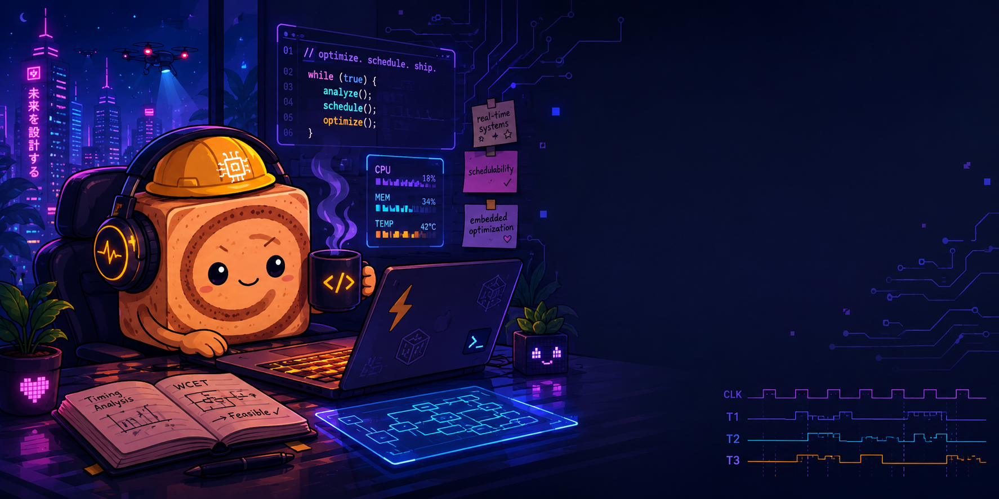

<!-- Profile README: alyssaserrano -->

  

<h1 align="center">Alyssa Serrano</h1>

  PhD Computational Science @ UC Irvine and San Diego State University 
  UCI–SDSU Joint Program 
  Resource-aware autonomous systems • Real-time scheduling • Embedded systems optimization

  <a href="https://brdsdsu.github.io/">Computer Systems Intelligence Lab (SDSU)</a>

## Research focus
I work on **performance + predictability** for autonomous/robotics workloads on embedded platforms.
My projects center on *measuring what matters* (latency variance, throughput, memory pressure) and then using profiling + scheduling/optimization techniques to improve real-time behavior.

- **GPU scheduling & isolation:** SM-aware scheduling/partitioning ideas to reduce latency variance under concurrent CNN execution
- **Real-time optimization:** profiling-driven changes to accelerate compute-intensive pipelines while keeping behavior stable
- **Reproducible benchmarking:** harnesses/containers so results are repeatable across loads and environments

**Toolkit:** C/C++, CUDA, Python, ROS, Docker, Bash/make, Nsight Compute; CI/CD with GitHub/GitLab

## GitHub stats

  
  

  

## Stack

  
  
  
  
  

